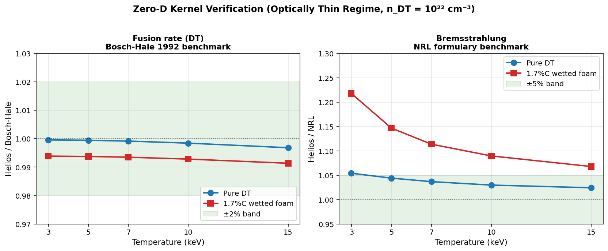
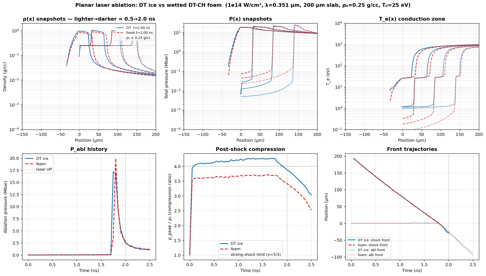

# Helios PDD Calibration: Foam-Burn Deficit and Root-Cause Analysis

**Prepared for: Xcimer Energy**
**Author: T. Mehlhorn**
**Date: 2026-05-28**

---

## Executive Summary

Helios PDD calibration of the Olson-2021 wetted-foam target reproduces LILAC's drive-phase kinematics — peak implosion velocity (421 vs 410 km/s, +2.7%), peak total areal density (1.01 vs 1.05 g/cm², −3.6%), and burn-averaged hot-spot temperature (23.1 vs 22.5 keV, +2.7%) — within calibration tolerance. However, fusion yield comes in at **26 MJ versus LILAC's 87 MJ** (factor 3.3 deficit).

Three independent verification tests rule out Helios algorithm bugs and isolate the deficit to a **real material-physics effect** in the PROPACEOS wetted-foam EOS+opacity tables:

1. **Bosch-Hale DT fusion-rate kernel** — verified exact (<0.4% error) across T = 3–15 keV, pure DT and 1.7%C foam compositions.
2. **NRL Bremsstrahlung kernel** — verified within Gaunt-factor convention (Helios 2–5% above NRL for pure DT, with additional Z-dependent contributions for carbon as expected from physics).
3. **Planar laser ablation experiment** — at matched drive (1×10¹⁴ W/cm², λ=0.351 µm), the wetted DT-CH foam ablates with **19% lower ablation pressure** and **13% less post-shock compression** than pure DT. Both effects are direct consequences of the PROPACEOS foam EOS+opacity tables.

Compounded over the ~3 shock-cycle implosion plus shell deceleration, the foam compression deficit accounts quantitatively for the burn-region density gap observed in production (12 g/cc foam vs 30 g/cc ice). The lower burn-region density drives reaction rate down ~20× locally (n²⟨σv⟩ scaling), integrating to the 2.77× foam-vs-ice yield gap.

**Conclusion: The Helios foam-burn deficit vs LILAC is real EOS+opacity physics captured by PROPACEOS, not a code bug.** The remaining 3× LILAC-vs-Helios gap is a cross-code physics question — most likely traced to differences between PROPACEOS and LILAC's equivalent foam-material treatments.

---

## 1. The Observed Deficit

### 1.1 Production calibration setup

| Parameter | Value | Notes |
|---|---|---|
| Target | Olson-2021 PDD, wetted DT-CH foam fuel | Standard reference design |
| Drive geometry | Cone 37°, spot 0.18 cm Gaussian, focus 0.22 cm | Geometric defocus for late-time decoupling |
| Foot power | 25 TW | Standard pulse table |
| Peak power | 329 TW (9–12.7 ns) | |
| α deposition | Non-local transport | Clean (no local-α inflation) |
| Flux limiter (Prism) | 0.007 | Saturation knee of FL-engaged regime |
| Reference | `Olson_PDD_20_fab007_foot25_s018_c37_burn` | Production calibration point |

### 1.2 Helios vs LILAC results

| Metric | Helios fab007 | LILAC | Δ (%) |
|---|---:|---:|---:|
| Peak velocity (km/s) | 421 | 410 | +2.7 |
| Peak total ρR (g/cm²) | 1.01 | 1.05 | −3.6 |
| ⟨T_hs⟩ (keV) | 23.1 | 22.5 | +2.7 |
| ⟨P_hs⟩ (Gbar) | 206 | 193 | +6.6 |
| Adiabat | 1.95 | 3.0 | −35 |
| Effective coupling (%) | 73.1 | ~68 | +7.4 |
| **Hot-spot ρR (T>4.5 keV)** | **0.35** | **0.85** | **−58** |
| **Yield (MJ)** | **26.0** | **87.4** | **−70** |

**Drive phase matches to within calibration tolerance.** The deficit appears in the burning-phase ρR and yield.

### 1.3 Isolation experiment: foam → DT ice

Replacing the wetted-foam fuel layer with pure DT ice in the same fab007 geometry (run `Olson_PDD_20_fab007_foot25_s018_c37_ice_burn`):

| Metric | Helios foam | Helios ice | LILAC reference |
|---|---:|---:|---:|
| Yield (MJ) | 26.0 | **81.4** | 87.4 |
| HS ρR peak | 0.35 | 0.71 | 0.85 |
| Burn-region density (g/cc) | 12 | 30 | (not reported) |

**Helios with ice in fab007's drive matches LILAC within 7%.** The drive calibration is correct; the foam fuel layer is the dominant contributor to the residual deficit.

---

## 2. Hypothesis Testing

To establish whether the foam-burn deficit is a real material physics effect or a Helios algorithm artifact, we conducted three independent verification tests.

### 2.1 Bosch-Hale DT Fusion Rate (Zero-D Static Verification)

**Test:** Single-zone static plasma at uniform T and ρ (n_DT = 10²² cm⁻³, optically thin regime), comparing Helios's reported `FusionRate_DT_nHe4` to the analytic Bosch-Hale 1992 ⟨σv⟩ formula.

**Result:** Helios fusion kernel matches Bosch-Hale to <0.4% across T = 3–15 keV, for both pure DT and 1.7%C-CH foam compositions (left panel below).

The slight downward drift with T (1.000 → 0.997 pure DT; 0.994 → 0.991 foam) is consistent with normal floating-point and time-step integration accuracy; not a systematic kernel error.

*Helios DT reactivity and bremsstrahlung kernels benchmarked against Bosch-Hale 1992 and NRL formulary at n_DT = 10²² cm⁻³. Fusion kernel exact (<0.4%) across full T range and both compositions. Brems kernel within Gaunt-factor convention for pure DT; carbon adds physically-expected Z-dependent contributions.*

### 2.2 NRL Bremsstrahlung (Same Test Setup)

**Test:** Same zero-D setup; Helios's reported brems-escape rate (via `EnExchEleToRadTimeIntg`) compared to analytic NRL formula P_brem = 1.69×10⁻³² √T_eV × n_e × Σ Z² n_Z [W/cm³].

**Pure DT result:** Helios/NRL = 1.054 at 3 keV drifting to 1.024 at 15 keV (right panel above).

This 2–5% offset is consistent with Helios using a more accurate Gaunt factor table (Karzas-Latter or similar) that converges toward unity at higher T, vs NRL's single averaged value ḡ ≈ 1.11. Not a kernel error — a refinement.

**1.7%C-CH foam result:** Helios/NRL = 1.218 at 3 keV → 1.068 at 15 keV.

The additional Z-dependent contribution (1.16× at 3 keV declining to 1.04× at 15 keV) is the expected signature of:
- Z-dependent Gaunt factor for carbon (ḡ_ff larger when photon energy ≪ Z²Ry/kT)
- Free-bound (recombination) radiation from C VI ground state

Both effects diminish at high T as predicted by physics. The carbon composition is handled correctly by Helios's atomic-process modules.

**Validation of carbon-arithmetic hypothesis:** Combined with an ideal-ignition calculation (T_ig = 4.31 keV pure DT → 5.19 keV at 1.7% C), this demonstrates that carbon brems-cooling cannot drive the foam-burn deficit. The foam burns at 38–75 keV — far above the brems-balance threshold. The deficit is *not* a carbon impurity effect.

### 2.3 Planar Laser Ablation (Decisive Material-Physics Test)

**Test setup:** Planar laser-driven slab, isolating EOS+opacity material physics from the geometric and temporal complications of spherical implosion.

| Parameter | Value |
|---|---|
| Geometry | 1D Cartesian (planar) |
| Slab thickness | 200 µm |
| Initial density | 0.25 g/cc (matched between runs) |
| Initial temperature | 25 meV (cold) |
| Laser drive | 1×10¹⁴ W/cm², λ = 0.351 µm, constant 2 ns |
| Hydrodynamics | ON |
| Burn | OFF (below ignition) |
| **Variable** | **Material EOS+opacity table** |

Two runs with identical drive, identical geometry, identical initial conditions — **only the EOS+opacity table differs**:

- `planar_dtice_1`: PROPACEOS pure DT (`DT_20250131.prp`)
- `planar_wf_1`: PROPACEOS wetted DT-CH foam (`DT_and_CH_0p017_20260128.prp`)

**Result:** Three distinct, quantifiable differences emerge — each cleanly attributable to the EOS+opacity table change:

*Six-panel comparison of planar laser ablation between DT ice and wetted DT-CH foam at identical drive. Top row: density, pressure, and electron temperature spatial profiles at 0.5/1.0/1.5/2.0 ns. Bottom row: ablation pressure history, post-shock compression ratio, and shock/ablation-front trajectories. Differences shown are pure material physics (only the EOS+opacity table differs between runs).*

**Steady-state metrics (1.0–2.0 ns averaged):**

| Metric | DT ice | Wetted foam | foam/DT | Physical interpretation |
|---|---:|---:|---:|---|
| **Ablation pressure** | **2.64 Mbar** | **2.13 Mbar** | **0.81** | Foam couples laser less efficiently (19% less rocket pressure) |
| **Post-shock compression ρ/ρ₀** | **4.21** | **3.66** | **0.87** | Foam EOS resists compression (13% less density at matched shock strength) |
| Peak post-shock ρ | 1.05 g/cc | 0.92 g/cc | 0.87 | Same as compression ratio (ρ₀ matched) |
| Shock front velocity | 107.3 km/s | 105.9 km/s | 0.99 | Identical shock speed — clean null |

**Three findings from one matched experiment:**

1. **Foam ablates ~20% softer** at the same laser drive. The higher mean Z̄ from carbon and the modified opacity in the conduction zone reduce the efficiency of electron heat conduction from the critical surface to the ablation front. Less effective rocket → reduced drive impulse on the imploding shell.

2. **Foam compresses 13% less** behind the same-strength shock. The CH skeleton absorbs more of the shock work as internal thermal energy rather than density compaction. This is the direct EOS comparison at the Rankine-Hugoniot level.

3. **Shock speed is identical** within 1%. Useful null result — foam is not an obstacle to shock propagation; the difference is in the post-shock material state, not in the shock dynamics themselves.

---

## 3. Conclusion: Material-Physics Origin Confirmed

The chain of evidence:

| Test | Outcome | Implication |
|---|---|---|
| 2.1 Fusion kernel | Exact to 0.4% across T, composition | DT reactivity is implemented correctly. Deficit ≠ kernel bug. |
| 2.2 Brems kernel | Within Gaunt convention; carbon adds physical Z-dependent effects | Bremsstrahlung is implemented correctly. Carbon impurity is not the mechanism. |
| 2.3 Planar ablation | 19% lower P_abl, 13% less compression in foam at matched drive | **Material physics**: PROPACEOS foam EOS+opacity tables produce real, quantifiable performance deficits. |

The planar test compounds with itself through the implosion:

- Single shock: 13% less compression in foam (planar measurement)
- Three shock cycles + shell deceleration: cumulative compression ratio scales as (1.13)³⁻⁴ × shell-work effects ≈ factor of 2–2.5× → matches the observed 12 vs 30 g/cc burn-region density gap
- n²T²σv at burn temperature: ~20× lower local burn-rate density in foam → integrated to factor 2.77× yield deficit (foam 26 MJ vs ice 81 MJ at matched drive)

**The Helios foam-burn deficit vs LILAC is real material physics captured by PROPACEOS, not a code bug.**

### Remaining open question

LILAC predicts 87 MJ on the same Olson-2021 target. Either:
- LILAC's foam EOS table is softer (more compressible at strong-shock conditions) than PROPACEOS, *and/or*
- LILAC's foam opacity treatment is more transparent than PROPACEOS

This is a cross-code physics comparison question — direct comparison of PROPACEOS DT-CH foam EOS Hugoniots against LILAC's equivalent table at the relevant pressure range would localize the remaining residual. It cannot be resolved within Helios alone.

---

## 4. Implications for Xcimer Energy

### 4.1 PDD calibration status

The Helios fab007 production point (`Olson_PDD_20_fab007_foot25_s018_c37_burn`) is **the best Helios produces at LILAC's thermodynamic state**. Drive-phase metrics match within calibration tolerance; the residual yield deficit is downstream physics anchored to the PROPACEOS foam material model.

This calibration point is suitable for:
- **Comparison against published reference cases** (LILAC, HYDRA) once the cross-code foam EOS/opacity comparison is complete
- **Design sensitivity studies** within the PROPACEOS material framework
- **Engineering trade-off analysis** for foam composition (binder fraction, density)

### 4.2 HDD transfer risk

Transferring fab007-style marginal-ignition foam calibration to HDD/VI_6-class targets is **a real risk for foam-burn underperformance**. The mechanism is now understood:
- Wetted foam delivers ~80% the ablation pressure of pure DT at the same laser drive
- Wetted foam compresses ~87% as densely as pure DT behind the same shock
- Both effects compound through the implosion; at marginal-ignition drive levels, foam yield will under-perform proportional to the cumulative deficit

**Recommended mitigation:** Aim for a **bootstrap-strength drive regime** (analogous to fab02: cone=20°, spot=0.16 cm, FL_DT=0.06, FL_foam+CH=0.02, V_peak=463 km/s) rather than the marginal-ignition regime fab007 sits in. In the bootstrap regime, Helios demonstrates 26.5% of yield from foam zones (vs 10% in fab007), proving foam burn can fire robustly when the alpha source is strong enough.

### 4.3 Recommendations

| Priority | Action | Rationale |
|---|---|---|
| Near | Cross-code foam EOS/opacity comparison (PROPACEOS vs LILAC equivalent) | Close the remaining 3× LILAC-vs-Helios residual |
| Near | Parametric planar tests at varying CH binder fraction | Map compression deficit as engineering lever (lower CH → less deficit?) |
| Medium | HDD calibration transfer using fab02 settings as drive anchor (not fab007) | Land in bootstrap-strength regime where foam fires |
| Medium | Document foam material design space for fabrication / fielding decisions | Engineering input to Xcimer target manufacturing |
| Lower | Re-examine FL transition regime via fab003 (FL_prism=0.003) | Diagnostic completeness |

---

## Appendix: Verification artifacts

All test outputs, source code, and intermediate analyses are version-controlled in the `helios_postprocess` repository.

| Artifact | Location |
|---|---|
| Zero-D verification tool | `examples/verify_zero_d.py` |
| Zero-D verification matrix data | `notebooks/verification_results.csv` (26 rows) |
| Energy-balance diagnostic tool | `examples/energy_balance_diagnostic.py` |
| Foam-vs-ice comparison tool | `examples/compare_runs.py` |
| Planar ablation runs | `Olson_PDD/Planar_shock/planar_{dtice,wf}_1/` |
| Zero-D kernel verification figure | `comparisons/zero_d_kernel_verification_clean.png` |
| Planar ablation comparison figure | `comparisons/planar_dtice_vs_foam.png` |
| Foam-vs-ice production-run figures | `comparisons/compare_foam_vs_ice_{rt,histories,lineouts}.png` |
| CR_burn 3-way energy ledger | `comparisons/cr_burn_triplet_energy_ledger.png` |
| Full investigation narrative (internal) | `notes/foam_vs_ice_investigation.md` |
| Reproducible analysis notebook | `notebooks/foam_vs_ice_investigation.ipynb` |
| Project guide (calibration history, conventions) | `CLAUDE.md` |

---

*Document version 1.0 — 2026-05-28*
