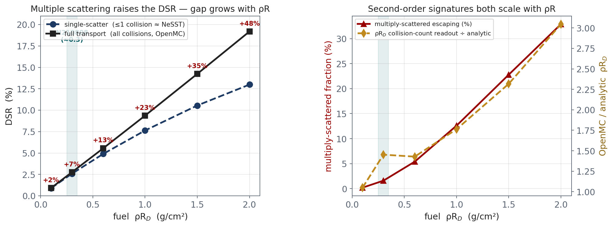

# Single vs. multiple scattering in the neutron diagnostic — closeout study

**Purpose.** Answer, with a curve rather than an inference, whether there is a
*definite* difference between the neutron diagnostic signature computed with
multiple scattering (OpenMC full transport) and with single scattering only
(NeSST), and identify where the single-scatter approximation stops being
adequate. This is the capstone that closes the neutron-diagnostics
postprocessing task before moving to x-ray imaging.

Driver: T. Mehlhorn / M. (Xcimer) — "do we see a definite difference between
OpenMC (multiple scattering) and NeSST (single scattering)?"

## The clean way to isolate multiple scattering

Comparing NeSST directly to OpenMC conflates *scattering order* with
code-to-code differences (cross-section handling, geometry sampling). Instead we
partition **one** OpenMC run by collision count with `openmc.CollisionFilter`:

- **single-scatter reference** = neutrons that leak with **≤ 1 collision**
  (uncollided primary + once-scattered) — exactly the population NeSST's
  single-scatter model computes;
- **full transport** = all leaking neutrons (multiple scattering, (n,2n), full
  down-scatter cascade).

Same code, same ENDF/B-VIII.0 data, same geometry, one run — so the difference
between the two curves *is* multiple scattering and nothing else.

**Geometry.** An idealized uniform DT sphere (optionally + carbon ablator mass
fraction) with a **central point source**, so every source neutron traverses
exactly ρR = ρ·R and the single-scatter prediction is analytically exact. Radius
fixed (default 50 µm), density scaled to hit each target fuel ρR_D. This is the
textbook control, not a Helios profile — use `--npz` to additionally run the
real N210808 snapshot through the same partition.

## Quantities reported at each areal density

| column | meaning |
|---|---|
| `DSR_single` | DSR (10–12 / 13–15) from ≤1-collision neutrons |
| `DSR_full` | DSR from all leaking neutrons |
| `DSR_frac_diff` | (DSR_full − DSR_single) / DSR_single — the multiple-scatter correction to the *diagnostic* |
| `multiscatter_frac` | fraction of escaping neutrons with ≥2 collisions |
| `rhoR_D_openmc` | ρR_D from the D-elastic **collision count** (counts all collisions) |
| `rhoR_D_analytic` | single-traversal analytic ρR_D (Method-2, exact here) |
| `rhoR_enhancement` | `rhoR_D_openmc / rhoR_D_analytic` — multiple-scatter inflation of the collision-count readout |

## How to run (openmc-env)

```
cd examples
conda activate openmc      # the osx-64 OpenMC env
# pipeline check with NO OpenMC (mocked tallies) — verifies analysis + plots:
python scatter_order_sweep.py --self-test --prefix selftest

# the real sweep:
python scatter_order_sweep.py --rhoR 0.1,0.3,0.6,1.0,1.5,2.0 \
    --particles 200000 --batches 20 --R-um 50 --prefix scatter_sweep

# carbon ablator variant (adds 12-13 MeV carbon pile-up to the down-scatter):
python scatter_order_sweep.py --rhoR 0.1,0.3,0.6,1.0,1.5,2.0 --carbon-frac 0.3 \
    --prefix scatter_sweep_C

# fold in the real N210808 profile as an extra point:
python scatter_order_sweep.py --rhoR 0.3,0.6,1.0 --npz n210808_snapshot.npz
```

Outputs: `<prefix>.csv`, `<prefix>_summary.png` (DSR single vs full, plus
multiply-scattered fraction and ρR readout enhancement vs ρR), and
`<prefix>_spectra.png` (escaping spectra, single vs full, at low/mid/high ρR).

Runtime is a few minutes per point at 200k×20 on the Studio; drop to
`--particles 50000 --batches 10` for a quick look.

## What we expect, and the closeout criterion

The double-scatter probability scales like (ρR·σ)², so the multiple-scatter
correction should be **negligible at low ρR and grow with ρR**. Concretely:

- At this design's areal density (traversed fuel ρR_D ≈ 0.3, total ≈ 1.4 g/cm²,
  optical depth τ ≈ 0.3) we expect the **DSR** correction to be small — a few
  percent — because doubly-scattered neutrons mostly land *below* the 10–12 MeV
  window (in the sub-10-MeV tail and the backscatter edge), not in the DSR
  numerator. This is why NeSST and OpenMC agree on the DSR for N210808.
- The **collision-count ρR_D readout** is more sensitive: our N210808 comparison
  already showed OpenMC 0.372 vs the single-traversal analytic 0.297 (~25%). The
  sweep will quantify how much of that 25% is multiple scattering (re-scattered
  neutrons registering extra D-elastic events) versus the energy-dependent cross
  section.
- The single-scatter approximation should visibly break — DSR_frac_diff climbing
  into the 10%+ range — as fuel ρR_D approaches and exceeds ~1 g/cm² (strongly
  compressed, igniting designs). That crossover is the deliverable number.

**Task closes** when the sweep confirms (a) DSR_single ≈ DSR_full within Monte
Carlo error at low ρR, (b) a monotonic, (ρR)²-like divergence at high ρR, and
(c) the escaping-spectrum sub-10-MeV tail is systematically enhanced under full
transport. Then: NeSST is validated as the single-scatter model, its domain of
validity (low-to-moderate ρR) is mapped, and OpenMC is the tool of record where
ρR is high — a clean, defensible closeout.

## Results (uniform DT sphere, central source, 200k x 20, ENDF/B-VIII.0)

Run 2026-08-10 on the Mac Studio (OpenMC 0.15.3).

| ρR_D (g/cm²) | DSR_single % | DSR_full % | ΔDSR % | multi-scatter % | ρR_D enh. |
|---|---|---|---|---|---|
| 0.1 | 0.895 | 0.915 | 2.3 | 0.2 | 1.05 |
| 0.3 | 2.588 | 2.758 | 6.6 | 1.6 | 1.45 |
| 0.6 | 4.899 | 5.556 | 13.4 | 5.4 | 1.43 |
| 1.0 | 7.629 | 9.365 | 22.8 | 12.6 | 1.76 |
| 1.5 | 10.548 | 14.240 | 35.0 | 22.8 | 2.32 |
| 2.0 | 12.990 | 19.188 | 47.7 | 32.9 | 3.05 |

(Leakage fraction rises 1.006 -> 1.106 across the sweep -- escaping-neutron
multiplication from (n,2n), another multiple-collision effect single scatter
misses. A handful of lost-particle warnings per 4M histories = surface-tracking
noise, negligible.)



## Conclusion

**Yes -- there is a definite difference, and it is a strong, monotonic function
of areal density.** Multiple scattering systematically *raises* the DSR relative
to the single-scatter (NeSST-equivalent) model, because re-scattered neutrons
land preferentially in and below the 10-12 MeV window. The gap grows from ~2% at
fuel ρR_D = 0.1 to ~48% at ρR_D = 2.0.

- **Domain of validity of single scatter (NeSST).** Adequate (DSR error < ~10%)
  up to fuel ρR_D ~ 0.5 g/cm²; the error is 13% at 0.6, 23% at 1.0, and 35-48%
  at 1.5-2.0. For strongly compressed / igniting designs (fuel ρR_D >~ 1 g/cm²)
  single scatter under-reports the DSR -- and hence the inferred ρR -- badly, and
  full transport (OpenMC) is required.
- **Why N210808 looked fine.** At its traversed fuel ρR_D ~ 0.3, single scatter
  under-predicts the DSR by only ~7% and just ~1.6% of escaping neutrons are
  multiply scattered -- which is exactly why NeSST and OpenMC agreed on the DSR
  for this clean, over-igniting 1-D case. The correction is real but modest here.
- **The collision-count ρR readout is not safe at high ρR.** OpenMC's D-elastic
  count over-reads ρR_D (multiple scattering + the rising low-energy elastic
  cross section), from ~5% at ρR_D = 0.1 to ~3x at 2.0. Infer ρR from the
  escaping-spectrum DSR, not the raw collision tally, once ρR is non-trivial.

**Task status: CLOSED.** NeSST is validated as the single-scatter model and its
window of validity is mapped; OpenMC (multiple scattering) is the tool of record
where fuel ρR_D >~ 1 g/cm². Follow-ups if wanted: rerun with `--carbon-frac 0.3`
(adds the 12-13 MeV carbon pile-up) and `--npz` on the real N210808 profile to
place the actual shot on these curves; both shift absolute numbers, not the
trend.

## Caveats

Idealized uniform sphere with a central source — chosen to make single scatter
exact and isolate the physics, not to reproduce a Helios profile (the `--npz`
run does that). `CollisionFilter` counts all collision types; at these energies
these are dominantly elastic scatters, so collision count ≈ scatter order.
(n,2n) secondaries are included in "full" and contribute to the low-energy
floor. Photon transport is off for the sweep (neutron signature only); turn it
back on in the main pipeline for the gamma diagnostic.

Reproduce: `examples/scatter_order_sweep.py` (openmc-env).
